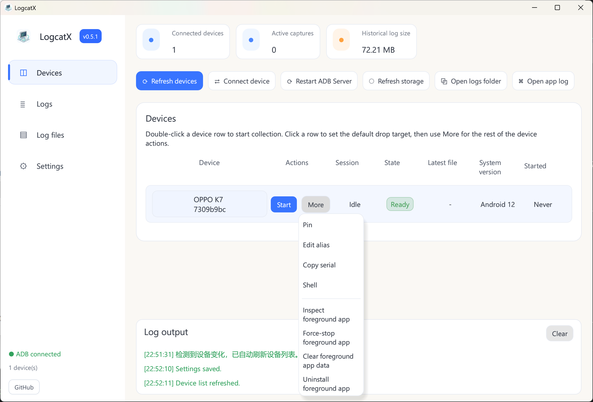
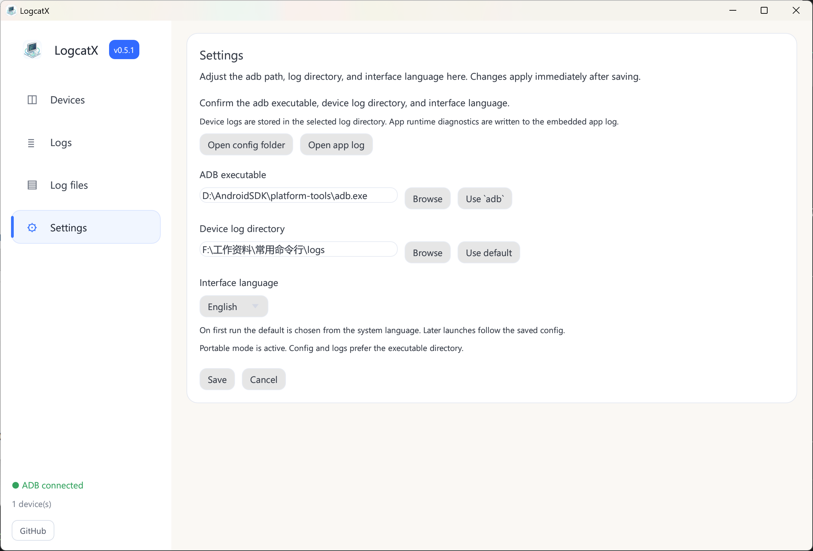

<p align="center">
  
</p>

<h1 align="center">LogcatX</h1>

A small desktop GUI tool for collecting `adb logcat` logs from multiple Android devices in parallel.

- [English Changelog](./CHANGELOG.en.md)
- [中文 README](./README.md)
- [中文更新日志](./CHANGELOG.md)
- [Update signing & release guide](./docs/update-signing.md) (中文)
- [MIT License](./LICENSE)

## Release target

- platform: **Windows**
- distribution: **portable zip** (ships the app plus an update helper; in-app updates included)
- current milestone: **v0.7.0**

## Screenshots

These screenshots show the current Windows UI for the Devices page and the Settings page.

<p align="center">
  
  
</p>

## Core capabilities

- show currently connected ADB devices in the main window
- start logcat collection by double-clicking a device row
- stop collection manually per device
- collect from multiple devices in parallel
- save device aliases, pins, and recent connection history
- resolve the default device title as **alias > manufacturer + model > serial**
- merge USB and Wi-Fi ADB transports for the same physical device and prefer USB when both are available
- connect directly with an `IP:port` endpoint
- refresh the device list automatically after USB changes
- show the Android version for each device in the device list
- show clearer device states such as ready, offline, unauthorized, and disconnected
- use a redesigned main window layout with a left sidebar, a main content area (overview cards, action buttons, and device list), and a fixed bottom log panel on the Devices page
- copy a device serial directly from the device-row menu
- open a device shell directly from the device-row menu
- edit aliases, pin devices, and open the device log folder or latest log file from the device-row menu
- capture the current device screen from the device-row menu and copy it to the Windows clipboard as an image
- mirror a device with scrcpy or create an independent virtual display from the device-row menu
- let a virtual display follow the primary display or use a portrait `720×1600` / `320 DPI` configuration, with a package-name field and filter for the launch target
- inspect the current foreground app and run force-stop, clear-data, or uninstall shortcuts from the device-row menu
- disconnect network devices directly from the list
- restart the ADB Server from the UI as a recovery action
- drag APK files into the window to install them on a device
- drag regular files into the window to copy them to `/sdcard/Download`
- generate both log directories and log file prefixes from the saved alias when available
- configure the `adb` executable path and the device-log output directory
- refresh device list and historical log size
- clear historical device logs while protecting active sessions
- inspect historical log usage and preview cleanup by device or time range
- write a separate **application runtime log** for diagnostics
- embedded English and Simplified Chinese UI with system-language default on first launch
- in-app update checks plus a once-daily automatic check (first window open after 08:00); updates are signature-verified and install with one download-and-restart action
- network proxy configuration can automatically use `HTTPS_PROXY` / `HTTP_PROXY` / `ALL_PROXY`, or a custom unauthenticated HTTP / SOCKS5 proxy; settings can test the proxy configuration against the GitHub homepage or a custom HTTPS URL
- shared infrastructure now comes from the public [DeskFoundry](https://github.com/Shawlaw/DeskFoundry) monorepo

## Portable behavior

The Windows release prefers `config.json` next to the exe, and falls back to AppData when the exe directory is not writable.

This keeps the normal zip download usable as a portable tool while still working in restricted directories.

## Logs

The app writes two different kinds of logs:

1. **Device logs** — the `adb logcat` output collected from Android devices
2. **Application log** — startup/runtime diagnostics for the collector itself

The application log is stored separately from device logcat output.

## First run

On first launch, the app asks the user to confirm:

- the `adb` executable path
- the directory used to store collected device logs

The settings dialog supports:

- choosing the UI language (English / Simplified Chinese)
- opening the config directory directly
- opening the application runtime log directly
- showing whether the app is currently running in portable mode or AppData mode
- showing a Google official Platform-Tools download link when ADB is not detected automatically

## Configuration example

See `config.example.json` for the current config shape.

## Windows build

```bash
cargo xwin build --target x86_64-pc-windows-msvc --release
```

## Windows release packaging

```bash
./scripts/package_windows_release.sh
```

This produces:

- `dist/LogcatX.exe`
- `dist/LogcatX_<version>_windows_x64_portable_<commit>.zip`

## GitHub Release CI

This repository includes a GitHub Actions release workflow. When you push a tag such as `v0.7.0`, it will:

1. verify that the tag matches the version in `Cargo.toml`
2. build the Windows release artifacts
3. create a GitHub Release
4. upload the matching portable zip package

## Troubleshooting

- If normal startup shows no console, that is expected for the Windows GUI build.
- For troubleshooting builds, enable the console feature or run with `--console`.
- If device collection fails, check the configured `adb` path and the application runtime log first.
