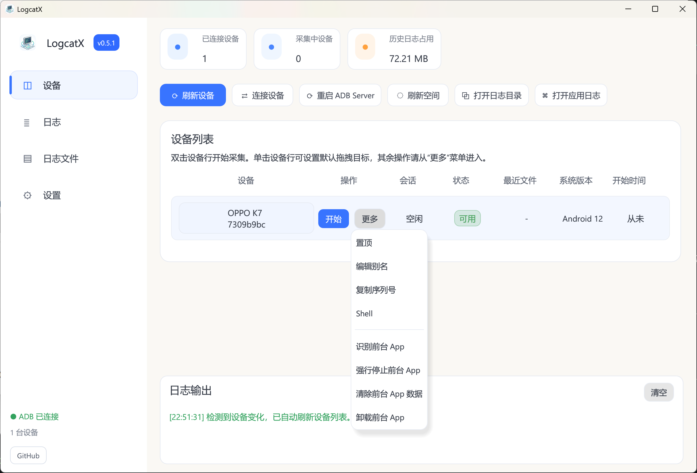
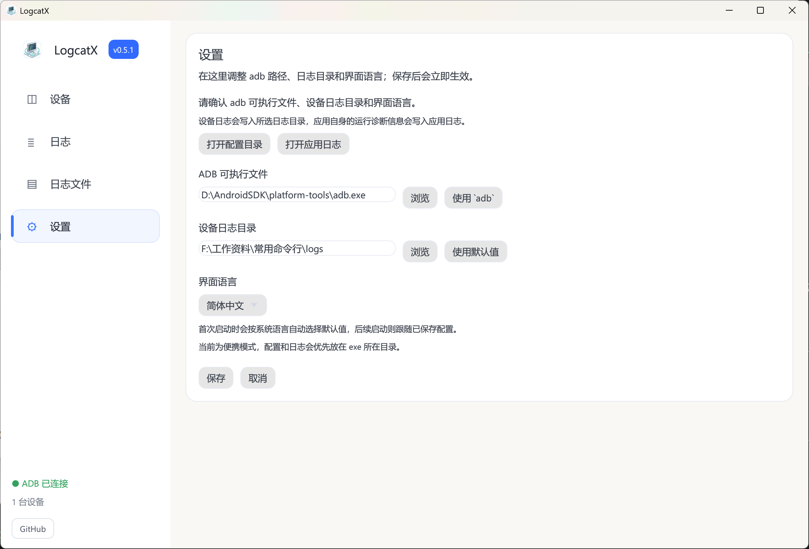

<p align="center">
  
</p>

<h1 align="center">LogcatX</h1>

LogcatX 是一个面向 Windows 发布的桌面 GUI 工具，用来并行采集多台 Android 设备的 `adb logcat` 日志。

## 文档入口

- [English README](./README.en.md)
- [更新日志](./CHANGELOG.md)
- [English Changelog](./CHANGELOG.en.md)
- [应用更新签名与发版说明](./docs/update-signing.md)
- [MIT License](./LICENSE)
- [配置示例](./config.example.json)
- [Windows 打包脚本](./scripts/package_windows_release.sh)

## 当前发布形态

- 平台：**Windows**
- 分发方式：**绿色版 zip**（内含主程序与更新助手，支持应用内检查并安装更新）
- 当前里程碑：**v0.6.0**

## 运行截图

以下截图展示当前 Windows 版的设备页与设置页界面。

<p align="center">
  
  
</p>

## 核心能力

- 主界面展示当前 ADB 已连接设备
- 双击设备行即可开始采集对应设备的 logcat
- 支持按设备手动停止采集
- 支持多设备并行采集
- 支持设备别名、置顶和最近连接记录
- 支持设备默认显示名按 **别名 > 厂商 + 型号 > 序列号** 回退
- 支持将同一物理设备的 USB / Wi-Fi ADB 连接聚合显示，并优先使用 USB
- 支持直接输入 `IP:端口` 快捷连接设备
- 支持 USB 设备变化后的自动刷新
- 支持在设备列表中显示 Android 版本
- 支持更清晰的设备状态展示（可用 / 离线 / 未授权 / 已断开）
- 支持重构后的主界面布局：左侧导航栏 + 右侧主内容区（概览卡片、操作按钮、设备列表）+ 底部固定日志面板（设备页）
- 支持从设备列表行菜单复制设备序列号
- 支持从设备列表行菜单直接唤起指定设备的 Shell
- 支持从设备列表行菜单编辑别名、置顶、打开日志目录
- 支持识别当前前台 App，并提供强停、清除数据、卸载等快捷动作
- 支持从列表页主动断开网络设备连接
- 支持一键重启 ADB Server 作为恢复手段
- 支持将 APK 直接拖入窗口安装到设备
- 支持将普通文件拖入窗口复制到设备 `/sdcard/Download`
- 支持按设备别名生成日志目录与日志文件名前缀
- 支持配置 `adb` 可执行文件路径和设备日志保存目录
- 支持刷新设备列表与历史日志占用空间
- 支持清理历史设备日志，同时保护正在写入的日志
- 支持独立的应用运行日志，便于排障
- 内置简体中文与英文界面，首次启动按系统语言选择默认值
- 支持应用内检查更新与每日自动检查（每天 08:00 后首次打开窗口时），更新包经签名校验后可一键下载并重启完成升级
- 底层公共能力已拆分到 [DeskFoundry](https://github.com/Shawlaw/DeskFoundry) 统一维护

## 便携模式说明

Windows 发布包会优先读取 exe 同目录下的 `config.json`；如果 exe 目录不可写，则自动回退到 AppData 目录。

这样既适合直接解压即用的绿色版场景，也能兼容受限目录下的运行环境。

## 日志说明

应用会写入两类日志：

1. **设备日志**：来自 Android 设备的 `adb logcat` 输出
2. **应用日志**：LogcatX 自身的启动与运行诊断信息

应用日志与设备日志相互独立，便于定位问题。

## 首次启动

首次启动时，应用会要求确认：

- `adb` 可执行文件路径
- 设备日志保存目录
- 界面语言

设置窗口同时支持：

- 直接打开配置目录
- 直接打开应用日志
- 查看当前是便携模式还是 AppData 模式
- 如果未自动检测到 ADB，会提供 Google 官方 Platform-Tools 下载链接（简体中文默认跳到 `android.google.cn`）

## 构建

```bash
cargo xwin build --target x86_64-pc-windows-msvc --release
```

## Windows 打包

```bash
./scripts/package_windows_release.sh
```

打包后会生成：

- `dist/LogcatX.exe`
- `dist/LogcatX-v0.5.2-win64.zip`

## GitHub Release CI

仓库内置了基于 GitHub Actions 的发布流程：当你推送形如 `v0.5.2` 的 tag 到远端时，会自动：

1. 校验 tag 与 `Cargo.toml` 中的版本号一致
2. 构建 Windows 发布版
3. 生成 GitHub Release
4. 上传 `LogcatX.exe` 和对应 zip 包

## 排障建议

- 正常发布版启动时不显示控制台窗口，这属于预期行为。
- 如果需要排查启动问题，可启用 `console` feature 或使用 `--console`。
- 如果设备采集失败，请优先检查已配置的 `adb` 路径以及应用运行日志。
